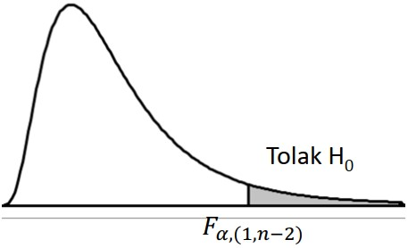
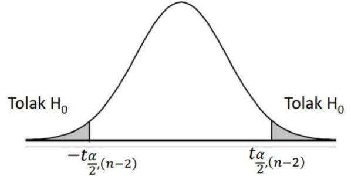

```{r xaringanExtra, echo=FALSE}
xaringanExtra::use_xaringan_extra(c("tile_view", "animate_css", "tachyons"))
```

```{r xaringan-panelset, echo=FALSE}
xaringanExtra::use_panelset()
```

```{r xaringan-scribble, echo=FALSE}
xaringanExtra::use_scribble()
```

```{r xaringan-logo, echo=FALSE}
xaringanExtra::use_logo(
  image_url = "Unsera.png"
)
```

```{r xaringanExtra-webcam, echo=FALSE}
xaringanExtra::use_webcam()
```

```{r xaringanExtra-search, echo=FALSE}
xaringanExtra::use_search(show_icon = TRUE)
```


.pull-left[
<br><br><br><br><br><br><br>


]

.pull-right[
<br><br><br>
# **.purple[Outline]**

- ##ANOVA satu faktor
- ##Uji Asosiasi - Chi Square

]

---

.pull.center[

## **ANOVA - Satu Faktor**

]

.pull-left[

### **Uji-Z**

- Untuk uji hipotesis pada kondisi sebaran populasi diasumsikan menyebar normal
dengan ragam populasi diketahui

- Untuk uji hipotesis terhadap proporsi dan selisih proporsi dua populasi

- Dapat digunakan untuk uji hipotesis terhadap rataan satu populasi, selisih rataan dua populasi

]

.pull-right[

### **Uji-t**

- Untuk uji hipotesis pada kondisi sebaran populasi diasumsikan menyebar normal
dengan ragam populasi tidak diketahui

- Dapat digunakan untuk uji hipotesis terhadap rataan satu populasi, selisih
rataan dua populasi, data berpasangan

]


---


### **Lalu bagaimana untuk menguji hipotesis <br> terhadap parameter dari .red[3 populasi (sub populasi) atau lebih]?**


.pull-left[

### Alternatif 1

Dilakukan uji 2 populasi (uji z atau uji t) bagi setiap pasangan populasi (sub populasi yang ada) <br><br>


]

.pull-right[
<br><br><br>

Perbandingan sepasang

### A vs B

### A vs C

### B vs C

Bagaimana jika terdapat .red[**lebih banyak**] populasi (sub populasi)?

]


---

.pull.center[

## **ANOVA - Satu Faktor**

]

.pull-left[

- ###Sebagai alternatif dalam perbandingan lebih dari 2 sub populasi dalam konteks 1 faktor peubah
- ###Dengan memanfaatkan tabel ANOVA dalam konteks pengujian hipotesisnya
- ###Kesimpulan yang diperoleh hanya sekedar apakah ada sub populasi yang memberikan hasil yang berbeda terhadap lainnya


]

--

.pull-right[

###Dalam konteks perancangan percobaan:
- ###Sebagai alat analisis untuk mengidentifikasi apakah terdapat pengaruh perlakuan yang berbeda terhadap respon yang diamati
- ###Faktor-faktor diluar perlakuan dikondisikan serbasama
- ###Kondisi unit percobaan diasumsikan serbasama (homogen)


]

---

.pull-left[

**Contoh**

Terdapat 3 kabupaten yang memiliki hasil produksi karet di Jawa Barat. Masing-masing kabupaten diambil hasil produksi pada 5 lahan karet yang berbeda. Diperoleh hasil sebagai berikut (dalam ton):

| Kebun ke-   | Kab A   | Kab B   | Kab C   |
| :--:        | :--:    | :--:    | :--:    |
| 1           | 5       | 10      | 7       |
| 2           | 7       | 11      | 6       |
| 3           | 6       | 9       | 4       |
| 4           | 7       | 12      | 3       |
| 5           | 8       | 10      | 5       |

Apakah terdapat rataan hasil produksi yang berbeda pada ketiga kabupaten tersebut?

]

.pull-right[

### **Model Linear Aditif**

### $Y_{ij}=\mu+\tau_i+\epsilon_{ij}$ 
atau
### $Y_{ij}=\mu_i+\epsilon_{ij}$
dengan:

$i=1,2,\dots,t$ dan $j=1,2,\dots,r$ <br>
$Y_{ij}=$ Pengamatan pada perlakuan ke-i dan ulangan ke-j <br>
$\mu=$ rataan umum <br>
$\tau_i=$ pengaruh perlakuan ke-i $=\mu_i-\mu$ <br>
$\epsilon_{ij}=$ pengaruh acak pada perlakuan ke-i dan ulangan ke-j
]
---

.pull.center[

## **Uji Hipotesis**

]

.pull-left[

### $H_0:\tau_1=\tau_2=\tau_3=0$ 
(perlakuan tidak berpengaruh terhadap respon yang diamati)
### $H_1:$ paling sedikit ada satu $i$ di mana $\tau_i \ne 0$

]


.pull-right[

### $H_0:\mu_1=\mu_2=\mu_3=\mu$ 
(semua perlakuan memberikan respon yang sama)
### $H_1:$ paling sedikit ada satu $i$ di mana $\mu_i \ne \mu$

]

---

.pull.center[

### **Tabel ANOVA**

]

.pull-left[

Jika ulangan .red[**sama**]: $r_1=r_2=\dots=r_t=r$

| Sumber Keragaman | Derajat Bebas (db) | Jumlah Kuadrat (JK) | Kuadrat Tengah (KT) | $F_0$ |
| :--: | :--: | :--: | :--: | :--: |
| Perlakuan | $t-1$     | JKP   | KTP | KTP/KTG |
| Galat     | $t(r-1)$  | JKG   | KTG |         |
| Total     | $tr-1$    | JKT   |     |         |


Jika ulangan .red[**tidak sama**]: $r_1\ne r_2\ne\dots \ne r_t$

| Sumber Keragaman | Derajat Bebas (db) | Jumlah Kuadrat (JK) | Kuadrat Tengah (KT) | $F_0$ |
| :--: | :--: | :--: | :--: | :--: |
| Perlakuan | $t-1$     | JKP   | KTP | KTP/KTG |
| Galat     | $\sum (r_i-1)$  | JKG   | KTG |         |
| Total     | $\sum r_i-1$    | JKT   |     |         |
]

.pull-right[

Langkah-langkah perhitungan:

- Faktor Koreksi (FK): $FK=\dfrac{\bar{Y}..}{N}$ dengan $N=tr=\sum r_i$
- Jumlah Kuadrat Total (JKT)
$$JKT=\sum_{i=1}^t\sum_{j=1}^{r_i}Y^2_{ij}-FK$$
- Jumlah Kuadrat Perlakuan (JKP)
$$JKP=\sum_{i=1}^t \dfrac{Y^2_{i.}}{r_i}-FK$$
- Jumlah Kuadrat Galat (JKG): $JKG=JKT-JKP$
]

---

.pull-left[

$i=1,2,3$ dan ulangan sama $r_1=r_2=r_3=5$
<br>

| Kebun ke-   | $Y_1$   | $Y_2$   | $Y_3$   | |
| :--:        | :--:    | :--:    | :--:    |:--:|
| 1           | 5       | 10      | 7       |
| 2           | 7       | 11      | 6       |
| 3           | 6       | 9       | 4       |
| 4           | 7       | 12      | 3       |
| 5           | 8       | 10      | 5       |
| $Y_{i.}$ | 33 | 52 | 25 | .red[**110**] |
| $Y^2_{i.}$ | 1089 | 2704 | 625 |
| $r_i$ | 5 | 5 | 5 | .red[**15**] |
| $Y^2_{i.}/r_i$ | 217.8 | 540.8 | 125 | .red[**883.6**] |

$Y..=\sum_{i=1}^3 Y_{i.}=110$; $N=\sum_{i=1}^3 r_i=15$ <br>
$\sum_{i=1}^3 Y^2_{i.}/r_i=883.6$ <br>
$FK=\dfrac{Y^2_{..}}{N}=\dfrac{110^2}{15}=806.67$

]

.pull-right[
Tabel perhitungan $Y^2_{ij}$
<br>

| Kebun ke-   | $Y^2_1$ | $Y^2_2$   | $Y^2_3$   | |
| :--:        | :--:    | :--:    | :--:    |:--:|
| 1           | 25       | 100      | 49       |
| 2           | 49       | 121      | 36       |
| 3           | 36       | 81       | 16       |
| 4           | 49       | 144      | 9       |
| 5           | 64       | 100      | 25       |
| Jumlah | 223 | 546 | 135 | .red[**904**] |

$\sum_{i=1}^t\sum_{j=1}^{r_i}Y^2_{ij}=904$

$JKT=\sum_{i=1}^t\sum_{j=1}^{r_i}Y^2_{ij}-FK=904-806.67=97.33$

$JKP=\sum_{i=1}^3 Y^2_{i.}/r_i-FK=883.6-806.67=76.93$

$JKG=JKT-JKP=97.33-76.93=20.4$


]

---

### Tabel ANOVA

.pull-left[

| Sumber Keragaman | Derajat Bebas (db) | Jumlah Kuadrat (JK) | Kuadrat Tengah (KT) | $F_0$ |
| :--: | :--: | :--: | :--: | :--: |
| Perlakuan | $2$     | $76.93$  | $38.47$ | $22.63$ |
| Galat     | $12$    | $20.4$   | $1.7$ |         |
| Total     | $14$    | $97.33$  |     |         |

**Titik Kritis** $F_{0.05,(2,12)}=3.89$

**Kesimpulan**:<br>
Karena $F_0=22.63>F_{0.05,(2,12)}$, maka $H_0$ ditolak. Cukup bukti untuk menyatakan bahwa minimal ada 1 kabupaten yang memiliki rata-rata hasil produksi karet yang berbeda dari kabupaten lainnya pada taraf nyata $5\%$.

]

.pull-right[

**Latihan**

]


---

.pull.center[

## **Uji Asosiasi Chi Square**

]

.pull-left[

### Statistik Non Parametrik
- Umumnya digunakan pada jenis data nominal dan ordinal

- Dapat digunakan pada populasi yang bebas distribusi dengan kata lain distribusi normal atau tidak normal

- Dapat digunakan pada jumlah sampel lebih kecil


]

.pull-right[

### Dari data yang dimiliki, seringkali diinginkan untuk dievaluasi adakah keterkaitan atau hubungan antar peubah-peubah yang ada.

###Peubah numerik $\rightarrow$ .red[**korelasi**] <br> Peubah kategorik $\rightarrow$ .red[**asosiasi**]

]

---

.pull.center[

## **Asosiasi**

]

.pull-left[

###Beberapa ilustrasi asosiasi antar peubah
- Hubungan antara pendapatan yang diterima dengan kepuasan kerja yang dirasakan

- Hubungan antara keputusan pembelian suatu produk tertentu dikaitkan dengan jenis kelamin atau tingkat pendapatan konsumen

- Hubungan antara status kredit nasabah (lancar atau macet) dengan status rumah (sendiri atau kontrak) dan lokasi tinggal (desa atau kota)


]

.pull-right[

###Uji Asosiasi Antara Dua Faktor

- Hubungan antara peubah kualitatif
  - ditarik dari sebuah sampel
  - tidak mempunyai hubungan kausalitas
  
- Asumsi
  - Experimen Multinomial (cacahan dari beberapa kategori)
  - Semua milai harapan ≥ dari 5
  
- Menggunakan Tabel kontingensi dua arah


]

---

.pull.center[

## **Tabulasi Silang**

###Eksplorasi asosiasi antar peubah bisa diawali dengan <br> tabulasi silang antar kedua peubah.

<table class="tg">
<thead>
  <tr>
    <th class="tg-baqh" rowspan="2">Peubah $A$</th>
    <th class="tg-baqh" colspan="4">Peubah $B$</th>
    <th class="tg-baqh" rowspan="2">Total</th>
  </tr>
  <tr>
    <th class="tg-baqh">Kategori 1</th>
    <th class="tg-baqh">Kategori 2</th>
    <th class="tg-baqh"> $\dots$ </th>
    <th class="tg-baqh">Kategori $q$</th>
  </tr>
</thead>
<tbody>
  <tr>
    <td class="tg-baqh">Kategori 1</td>
    <td class="tg-baqh"> $O_{11}$ <br></td>
    <td class="tg-baqh"> $O_{12}$ </td>
    <td class="tg-baqh"> $\dots$ </td>
    <td class="tg-baqh"> $O_{1q}$ </td>
    <td class="tg-baqh"> $B_1$ </td>
  </tr>
  <tr>
    <td class="tg-baqh">Kategori 2</td>
    <td class="tg-baqh"> $O_{21}$ </td>
    <td class="tg-baqh"> $O_{22}$ </td>
    <td class="tg-baqh"> $\dots$ </td>
    <td class="tg-baqh"> $O_{2q}$ </td>
    <td class="tg-baqh"> $B_2$ </td>
  </tr>
  <tr>
    <td class="tg-baqh"> $\dots$ </td>
    <td class="tg-baqh"> $\dots$ </td>
    <td class="tg-baqh"> $\dots$ </td>
    <td class="tg-baqh"> $\dots$ </td>
    <td class="tg-baqh"> $\dots$ </td>
    <td class="tg-baqh"> $\dots$ </td>
  </tr>
  <tr>
    <td class="tg-baqh">Kategori $p$ </td>
    <td class="tg-baqh"> $O_{p1}$ </td>
    <td class="tg-baqh"> $O_{p2}$ </td>
    <td class="tg-baqh"> $\dots$ </td>
    <td class="tg-baqh"> $O_{pq}$ </td>
    <td class="tg-baqh"> $B_p$ </td>
  </tr>
  <tr>
    <td class="tg-baqh">Total</td>
    <td class="tg-baqh"> $K_1$ </td>
    <td class="tg-baqh"> $K_2$ </td>
    <td class="tg-baqh"> $\dots$ </td>
    <td class="tg-baqh"> $K_q$ </td>
    <td class="tg-baqh"> $N$ </td>
  </tr>
</tbody>
</table>

]


---

.pull-left[

### Tabel Kontingensi Dua Arah

<table class="tg">
<thead>
  <tr>
    <th class="tg-baqh" rowspan="2">Faktor I</th>
    <th class="tg-baqh" colspan="2">Faktor II</th>
    <th class="tg-baqh" rowspan="2">Total</th>
  </tr>
  <tr>
    <th class="tg-baqh">Kategori 1</th>
    <th class="tg-baqh">Kategori 2</th>
  </tr>
</thead>
<tbody>
  <tr>
    <td class="tg-baqh">Kategori 1</td>
    <td class="tg-baqh"> $O_{11}$ $(a)$</td>
    <td class="tg-baqh"> $O_{12}$ $(b)$</td>
    <td class="tg-baqh"> $a+b$</td>
  </tr>
  <tr>
    <td class="tg-baqh">Kategori 2</td>
    <td class="tg-baqh"> $O_{21}$ $(c)$</td>
    <td class="tg-baqh"> $O_{22}$ $(d)$</td>
    <td class="tg-baqh"> $c+d$</td>
  </tr>
  <tr>
    <td class="tg-baqh">Total</td>
    <td class="tg-baqh"> $a+c$</td>
    <td class="tg-baqh"> $b+d$</td>
    <td class="tg-baqh"> $n$</td>
  </tr>
</tbody>
</table>

Keterangan:

$O_{ij}$: Obeservasi baris ke- $i$ dan kolom ke- $j$

$O_{11}=a$, $O_{12}=b$, $O_{21}=c$, $O_{22}=d$

$O_{11}+O_{12}+O_{21}+O_{22}=a+b+c+d=n$

]

.pull-right[

### Uji Hipotesis untuk mengetahui <br> ada atau tidaknya asosiasi <br>antar peubah

**Hipotesis**

$H_0:$ Tidak ada asosiasi antar peubah <br>
$H_1:$ Ada asosiasi antar peubah

Apabila $H_0$ benar, semestinya frekuensi masing-masing sel (frekuensi harapan) pada tabulas silang adalah 

$$E_{ij}=\dfrac{B_i \times K_j}{N}$$

$B_i:$ Total baris ke- $i$ <br>
$K_j:$ Total kolom ke- $j$


]


---

.pull-left[

**Statistik Uji**

Semakin jauh nilai frekuensi sebenarnya $(O_{ij})$ dengan frekuensi harapan $(E_{ij})$, maka semakin besar kemungkinan $H_0$ salah atau tidak didukung oleh data.

Berikut adalah statistik uji untuk pengujian asosiasi.

$$\chi^2_0=\sum\limits_{i=1}^p \sum\limits_{j=i}^q \dfrac{(O_{ij}-E_{ij})^2}{E_{ij}}$$
Jika $H_0$ benar, maka $\chi^2_0$ berdistribusi $\chi^2$ dengan derajat bebas $db=(p-1)(q-1)$.

**Titik Kritis**: $\chi^2_{[(p-1)(q-1);\alpha]}$

**Daerah Penolakan**: $H_0$ ditolak jika $\chi^2_0 > \chi^2_{[(p-1)(q-1);\alpha]}$

]


.pull-right[

**Contoh**

]

---

.pull.center[

### **Uji Hipotesis**

]

.pull-left[

- Titik Kritis $\rightarrow$ $F_{\alpha,(1,n-2)}$

- Daerah penolakan $H_0$



- Kesimpulan <br>
  Tolak $H_0 \rightarrow$ Cukup bukti untuk menyatakan bahwa model tersebut
sesuai/pas pada taraf nyata $\alpha$

]

--

.pull-right[

### Uji parsial (per koefisien) $\rightarrow$ Uji t

- Uji apakah peubah penjelas mempengaruhi peubah respon?

  - Hipotesis : <br>
    $H0 : \beta_1 = 0$ $(X$ tidak mempengaruhi $Y)$ <br>
    $H1 : \beta_1 \ne 0$ $(X$ mempengaruhi $Y)$
    
  - Statistik Uji
  
  $$t_0=(b_1-\beta_1)\sqrt{\dfrac{\text{JK}_{XX}}{\text{KTG}}}$$
  - Titik kritis
  $$t_{\frac{\alpha}{2},(n-2)}$$
  
]

---

.pull.center[

### **Uji Hipotesis**

]

.pull-left[

- Wilayah penolakan $H_0$
  
  

- Kesimpulan <br>
  Tolak $H_0 \rightarrow$  Cukup bukti untuk menyatakan bahwa $X$ mempengaruhi $Y$ secara linear pada taraf nyata $\alpha$

]

--

.pull-right[

### Koefisien Determinasi $(R^2)$

### $$R^2=\dfrac{\text{JKR}}{\text{JKT}}\times100\%$$

.red[**Interpretasi**] : sebesar $R^2$ keragaman $Y$ mampu dijelaskan
oleh $X$, sedangkan sisanya $(100-R^2)\%$ dijelaskan oleh faktor lain
yang tidak dimasukkan dalam model

Dalam regresi linear sederhana:
$$(r)^2=R^2$$

]

---

.pull-left[

**Contoh**

Promosi penjualan untuk suatu produk diduga mempengaruhi besar kecilnya penjualan dari produk tersebut. Untuk menguji dugaan tersebut, dipilih 5 buah produk secara acak dan diperoleh data sebagai berikut.

| $X$ | 1 | 2 | 4 | 6 | 7 |
|:--: |:--: |:--: |:--: |:--: |:--: |
| $Y$ | 3 | 5 | 7 | 8 | 10 |

di mana:<br>
$X:$ % kenaikan biaya promosi dalam setahun<br>
$Y:$ % kenaikan penjualan selama setahun

Tentukan:<br>
- Peubah respon dan peubah penjelas
- Apakah model regresi linear sesuai pada $\alpha=5\%$?
- Apakah variabel $Y$ mampu dijelaskan oleh variabel $X$ pada $\alpha=5\%$?
- Koefisien determinasi
- Prediksi penjualan jika biaya promosi dinaikan sebesar 5%.

]

--

.pull-right[

- Peubah respon: **% kenaikan penjualan selama setahun $(Y)$** <br>
  Peubah penjelas: **% kenaikan biaya promosi dalam setahun $(X)$**
  
- Untuk mengetahui apakah model regresi linear sesuai, maka bisa menggunakan uji simultan (bersama)

|No| $X$ | $Y$ | $XY$ | $X^2$ | $Y^2$ |
|:--:|:--:|:--:|:--:|:--:|:--:|
|1|1|3|3|1|9|
|2|2|5|10|4|25|
|3|4|7|28|16|49|
|4|6|8|48|36|64|
|5|7|10|70|49|100|
| $\sum$ |20|33|159|106|247|

$\sum x_i=20$, $\sum y_i=33$, $\sum x_i y_i=159$ <br>
$\sum x^2_i=106$, $\sum y^2_i=247$
]

---

.pull-left[

Model regresi linear yang digunakan:
$$Y_i=\beta_0+\beta_1X_i+\epsilon_i$$
Penduga untuk $\beta_1$:
$$\begin{align*}
b_1&=\dfrac{n\sum x_iy_i-\sum x_i \sum y_i}{n\sum x^2_i-(\sum x_i)^2}\\
&=\dfrac{5(159)-20(33)}{5(106)-(20)^2} \\
&=1.04
\end{align*}$$
Penduga untuk $\beta_0$:
$$\begin{align*}
b_0&=\bar{Y}-b_1\bar{X} \\
&=\dfrac{\sum y_i}{n}-b_1\dfrac{\sum x_i}{n} \\
&=\dfrac{33}{5}-1.04\dfrac{20}{5} \\
&=2.44
\end{align*}$$
]

--

.pull-right[

Jadi, persamaan regresi linearnya adalah:
$$\hat{Y}_i=2.44+1.04X_i$$
Setiap kenaikain biaya promosi sebesar 1% akan meningkatkan penjualan sebesar 1.04%

**Uji Simultan (bersama)**

- Hipotesis : <br>
    $H0 : \beta_1 = 0$ ( model tidak sesuai/pas) <br>
    $H1 : \beta_1 \ne 0$ ( model sesuai/pas)
    
- Taraf nyata $5\%$

- Statistik Uji
  
  $$F_0=\dfrac{\text{KTR}}{\text{KTG}}$$

$\text{JK}_{XY}=\sum x_i y_i-\dfrac{\sum x_i \sum y_i}{n}=159-\dfrac{20(33)}{5}=27$

$\text{JK}_{YY}=\sum y^2_i-\dfrac{(\sum y_i)^2}{n}=247-\dfrac{(33)^2}{5}=29.2$

]

---


.pull-left[
### ANOVA

| Sumber    | db   | Jumlah Kuadrat (JK)    | Kuadrat Tengah (KT)    | $F_0$ |
|:--        |:--:   | :--:  | :--:  | :--:  |
| Regresi   | 1     | $28.08$  | $28.08$ | $75.89$ |
| Galat     | $3$ | $1.12$  | $0.37$ |   |
| Total     | $4$ | $29.2$  |   |   |

$\text{JKT}=\text{JK}_{YY}=29$

$\text{JKR}=b_1\times\text{JK}_{XY}=1.04\times27=28.08$

$\text{JKG}=\text{JKT}-\text{JKR}=29.2-28.08=1.12$

$\text{KTR}=\text{JKR}/1=28.08$

$\text{KTG}=\text{JKG}/3=1.12/3=0.37$

$\text{JK}_{XX}=\sum x^2_i-\dfrac{(\sum x_i)^2}{n}=106-\dfrac{(20)^2}{5}=26$

]

--

.pull-right[

- Titik Kritis
$$F_{0.05,(1,3)}=10.13$$<br>
$H_0$ ditolak jika $F_0>F_{0.05,(1,3)}$

- Kesimpulan <br>
  Karena $F_0=75.89>10.13$, maka $H_0$ ditolak. Cukup bukti untuk menyatakan bahwa model tersebut sesuai/pas pada taraf nyata $5\%$


**Untuk menguji apakah variabel $Y$ bisa dijelaskan oleh variabel $X$, maka bisa dilakukan uji parsial**

- Hipotesis : <br>
    $H0 : \beta_1 = 0$ $(X$ tidak mempengaruhi $Y)$ <br>
    $H1 : \beta_1 \ne 0$ $(X$ mempengaruhi $Y)$
    
- Statistik Uji
  
$$t_0=(b_1-\beta_1)\sqrt{\dfrac{\text{JK}_{XX}}{\text{KTG}}}=8.72$$
 
]
---

.pull-left[

 - Titik kritis
  $$t_{\frac{\alpha}{2},(n-2)}=t_{0.025,3}=3.18$$
  $H_0$ ditolak jika $t_0<-3.18$ atau $t_0>3.18$
  
- Kesimpulan <br>
  Karena $t_0=8.72>3.18$, maka $H_0$ ditolak. Cukup bukti untuk menyatakan bahwa $X$ mempengaruhi $Y$ secara linear pada taraf nyata $5\%$


**Koefisien Determinasi $R^2$**

$R^2=\dfrac{\text{JKR}}{\text{JKT}}\times100\%=\dfrac{28.08}{29.2}\times100\%=96.2\%$

Interpretasi: 96.2% keragaman pada variabel $Y$ mampu dijelaskan
oleh variabel $X$, sedangkan sisanya $3.8\%$ keragaman dijelaskan oleh variabel/faktor lain yang tidak dimasukkan dalam model regresi.

]

--

.pull-right[

**Prediksi penjualan jika biaya <br> promosi dinaikan sebesar 5%**

Persmaan regresi linear sederhana yang <br> diperoleh adalah

$$\hat{Y}_i=2.44+1.04X_i$$
Jika diketahui % kenaikan biaya promosi sebesar 5% $(X=5\%)$, maka prediksi nilai penjualannya $(\hat{Y})$ adalah

$$\hat{Y}=2.44+1.04(5)=7.64$$
Jika kenaikan biaya promosi adalah sebesar 5%, maka penjualan diprediksi akan naik sebesar 7.64%.
]


---

.pull-left[

### Keterbatasan Korelasi dan Regresi Linear Sederhana
- ###Korelasi dan Regresi Linear hanya menggambarkan hubungan yang linear
- ###Korelasi dan metode kuadrat terkecil pada regresi linear tidak resisten terhadap pencilan
- ###Prediksi di luar selang nilai X tidak diperkenankan karena kurang akurat
- ###Hubungan antara dua peubah bisa dipengaruhi oleh peubah lain di luar model
]

--

.pull-right[

**Latihan**

Apakah semakin tua mobil semakin besar juga emisi HC yang dihasilkan?

Diambil contoh 10 mobil secara acak, kemudian dicatat jarak tempuh yang sudah dijalani mobil (dalam ribu kilometer) dan diukur Emisi HC-nya (dalam ppm)

|Jarak|31|38|48|52|63|67|75|84|89|99|
|:--:|:--:|:--:|:--:|:--:|:--:|:--:|:--:|:--:|:--:|:--:|
|Emisi|553|590|608|682|752|725|834|752|845|960|

Tentukan:<br>
- Peubah respon dan peubah penjelas
- Apakah model regresi linear sesuai pada $\alpha=5\%$?
- Apakah variabel $Y$ mampu dijelaskan oleh variabel $X$ pada $\alpha=5\%$?
- Koefisien determinasi
- Dugaan emisi yang dihasilkan jika jarak 50 dan 200

]

---

class: inverse, center, middle

# Thank you!
# See you next week

