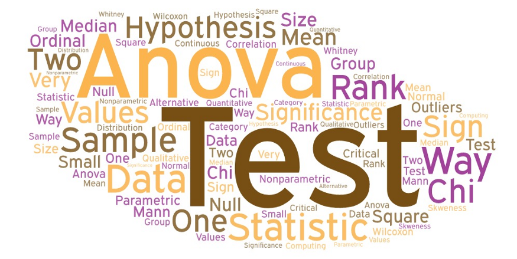
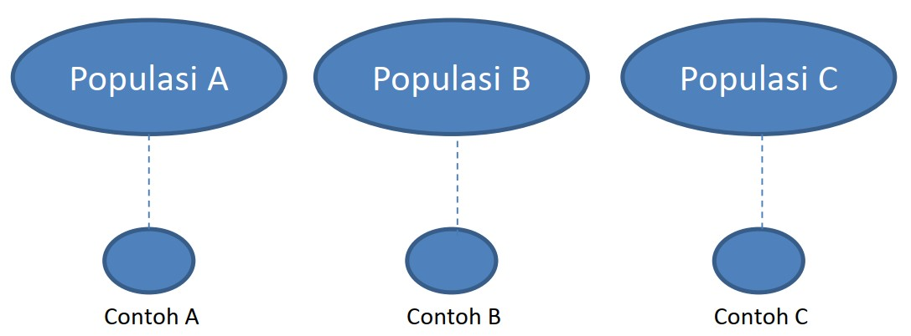

```{r xaringanExtra, echo=FALSE}
xaringanExtra::use_xaringan_extra(c("tile_view", "animate_css", "tachyons"))
```

```{r xaringan-panelset, echo=FALSE}
xaringanExtra::use_panelset()
```

```{r xaringan-scribble, echo=FALSE}
xaringanExtra::use_scribble()
```

```{r xaringan-logo, echo=FALSE}
xaringanExtra::use_logo(
  image_url = "Unsera.png"
)
```

```{r xaringanExtra-webcam, echo=FALSE}
xaringanExtra::use_webcam()
```

```{r xaringanExtra-search, echo=FALSE}
xaringanExtra::use_search(show_icon = TRUE)
```


.pull-left[
<br><br><br><br><br><br><br>


]

.pull-right[
<br><br><br>
# **.purple[Outline]**

- ##ANOVA satu faktor
- ##Uji Asosiasi - Chi Square

]

---

.pull.center[

## **Pendahuluan**

]

.pull-left[

### **Uji-Z**

- Untuk uji hipotesis pada kondisi sebaran populasi diasumsikan menyebar normal
dengan ragam populasi diketahui

- Untuk uji hipotesis terhadap proporsi dan selisih proporsi dua populasi

- Dapat digunakan untuk uji hipotesis terhadap rataan satu populasi, selisih rataan dua populasi

]

--

.pull-right[

### **Uji-t**

- Untuk uji hipotesis pada kondisi sebaran populasi diasumsikan menyebar normal
dengan ragam populasi tidak diketahui

- Dapat digunakan untuk uji hipotesis terhadap rataan satu populasi, selisih
rataan dua populasi, data berpasangan

]


---


### **Lalu bagaimana untuk menguji hipotesis <br> terhadap parameter dari .red[3 populasi (sub populasi) atau lebih]?**


.pull-left[

### Alternatif 1

Dilakukan uji 2 populasi (uji z atau uji t) bagi setiap pasangan populasi (sub populasi yang ada) <br><br>



]

.pull-right[
<br><br><br>

Perbandingan sepasang

### A vs B

### A vs C

### B vs C

Bagaimana jika terdapat .red[**lebih banyak**] populasi (sub populasi)?

]


---

.pull.center[

## **ANOVA - Satu Faktor**

]

.pull-left[

- ###Sebagai alternatif dalam perbandingan lebih dari 2 sub populasi dalam konteks 1 faktor peubah
- ###Dengan memanfaatkan tabel ANOVA dalam konteks pengujian hipotesisnya
- ###Kesimpulan yang diperoleh hanya sekedar apakah ada sub populasi yang memberikan hasil yang berbeda terhadap lainnya


]

--

.pull-right[

###Dalam konteks perancangan percobaan:
- ###Sebagai alat analisis untuk mengidentifikasi apakah terdapat pengaruh perlakuan yang berbeda terhadap respon yang diamati
- ###Faktor-faktor diluar perlakuan dikondisikan serbasama
- ###Kondisi unit percobaan diasumsikan serbasama (homogen)


]

---

.pull-left[

**Contoh**

Terdapat 3 kabupaten yang memiliki hasil produksi karet di Jawa Barat. Masing-masing kabupaten diambil hasil produksi pada 5 lahan karet yang berbeda. Diperoleh hasil sebagai berikut (dalam ton):

| Kebun ke-   | Kab A   | Kab B   | Kab C   |
| :--:        | :--:    | :--:    | :--:    |
| 1           | 5       | 10      | 7       |
| 2           | 7       | 11      | 6       |
| 3           | 6       | 9       | 4       |
| 4           | 7       | 12      | 3       |
| 5           | 8       | 10      | 5       |

Apakah terdapat rataan hasil produksi yang berbeda pada ketiga kabupaten tersebut?

]

--

.pull-right[

### **Model Linear Aditif**

### $Y_{ij}=\mu+\tau_i+\epsilon_{ij}$ 
atau
### $Y_{ij}=\mu_i+\epsilon_{ij}$
dengan:

$i=1,2,\dots,t$ dan $j=1,2,\dots,r$ <br>
$Y_{ij}=$ Pengamatan pada perlakuan ke-i dan ulangan ke-j <br>
$\mu=$ rataan umum <br>
$\tau_i=$ pengaruh perlakuan ke-i $=\mu_i-\mu$ <br>
$\epsilon_{ij}=$ pengaruh acak pada perlakuan ke-i dan ulangan ke-j
]
---

.pull.center[

## **Uji Hipotesis**

]

.pull-left[

### $H_0:\tau_1=\tau_2=\tau_3=0$ 
(perlakuan tidak berpengaruh terhadap respon yang diamati)
### $H_1:$ paling sedikit ada satu $i$ di mana $\tau_i \ne 0$

]


.pull-right[

### $H_0:\mu_1=\mu_2=\mu_3=\mu$ 
(semua perlakuan memberikan respon yang sama)
### $H_1:$ paling sedikit ada satu $i$ di mana $\mu_i \ne \mu$

]

---

.pull.center[

### **Tabel ANOVA**

]

.pull-left[

Jika ulangan .red[**sama**]: $r_1=r_2=\dots=r_t=r$

| Sumber Keragaman | Derajat Bebas (db) | Jumlah Kuadrat (JK) | Kuadrat Tengah (KT) | $F_0$ |
| :--: | :--: | :--: | :--: | :--: |
| Perlakuan | $t-1$     | JKP   | KTP | KTP/KTG |
| Galat     | $t(r-1)$  | JKG   | KTG |         |
| Total     | $tr-1$    | JKT   |     |         |


Jika ulangan .red[**tidak sama**]: $r_1\ne r_2\ne\dots \ne r_t$

| Sumber Keragaman | Derajat Bebas (db) | Jumlah Kuadrat (JK) | Kuadrat Tengah (KT) | $F_0$ |
| :--: | :--: | :--: | :--: | :--: |
| Perlakuan | $t-1$     | JKP   | KTP | KTP/KTG |
| Galat     | $\sum (r_i-1)$  | JKG   | KTG |         |
| Total     | $\sum r_i-1$    | JKT   |     |         |
]

--

.pull-right[

Langkah-langkah perhitungan:

- Faktor Koreksi (FK): $FK=\dfrac{\bar{Y}..}{N}$ dengan $N=tr=\sum r_i$
- Jumlah Kuadrat Total (JKT)
$$JKT=\sum_{i=1}^t\sum_{j=1}^{r_i}Y^2_{ij}-FK$$
- Jumlah Kuadrat Perlakuan (JKP)
$$JKP=\sum_{i=1}^t \dfrac{Y^2_{i.}}{r_i}-FK$$
- Jumlah Kuadrat Galat (JKG): $JKG=JKT-JKP$
]

---

.pull-left[

$i=1,2,3$ dan ulangan sama $r_1=r_2=r_3=5$
<br>

| Kebun ke-   | $Y_1$   | $Y_2$   | $Y_3$   | |
| :--:        | :--:    | :--:    | :--:    |:--:|
| 1           | 5       | 10      | 7       |
| 2           | 7       | 11      | 6       |
| 3           | 6       | 9       | 4       |
| 4           | 7       | 12      | 3       |
| 5           | 8       | 10      | 5       |
| $Y_{i.}$ | 33 | 52 | 25 | .red[**110**] |
| $Y^2_{i.}$ | 1089 | 2704 | 625 |
| $r_i$ | 5 | 5 | 5 | .red[**15**] |
| $Y^2_{i.}/r_i$ | 217.8 | 540.8 | 125 | .red[**883.6**] |

$Y..=\sum_{i=1}^3 Y_{i.}=110$; $N=\sum_{i=1}^3 r_i=15$ <br>
$\sum_{i=1}^3 Y^2_{i.}/r_i=883.6$ <br>
$FK=\dfrac{Y^2_{..}}{N}=\dfrac{110^2}{15}=806.67$

]

--

.pull-right[
Tabel perhitungan $Y^2_{ij}$
<br>

| Kebun ke-   | $Y^2_1$ | $Y^2_2$   | $Y^2_3$   | |
| :--:        | :--:    | :--:    | :--:    |:--:|
| 1           | 25       | 100      | 49       |
| 2           | 49       | 121      | 36       |
| 3           | 36       | 81       | 16       |
| 4           | 49       | 144      | 9       |
| 5           | 64       | 100      | 25       |
| Jumlah | 223 | 546 | 135 | .red[**904**] |

$\sum_{i=1}^t\sum_{j=1}^{r_i}Y^2_{ij}=904$

$JKT=\sum_{i=1}^t\sum_{j=1}^{r_i}Y^2_{ij}-FK=904-806.67=97.33$

$JKP=\sum_{i=1}^3 Y^2_{i.}/r_i-FK=883.6-806.67=76.93$

$JKG=JKT-JKP=97.33-76.93=20.4$


]

---

.pull-left[

### Tabel ANOVA

| Sumber Keragaman | Derajat Bebas (db) | Jumlah Kuadrat (JK) | Kuadrat Tengah (KT) | $F_0$ |
| :--: | :--: | :--: | :--: | :--: |
| Perlakuan | $2$     | $76.93$  | $38.47$ | $22.63$ |
| Galat     | $12$    | $20.4$   | $1.7$ |         |
| Total     | $14$    | $97.33$  |     |         |

**Titik Kritis** $F_{0.05,(2,12)}=3.89$

**Kesimpulan**:<br>
Karena $F_0=22.63>F_{0.05,(2,12)}$, maka $H_0$ ditolak. Cukup bukti untuk menyatakan bahwa minimal ada 1 kabupaten yang memiliki rata-rata hasil produksi karet yang berbeda dari kabupaten lainnya pada taraf nyata $5\%$.

]

--

.pull-right[

**Latihan**

Terdapat 3 kabupaten yang memiliki hasil produksi karet di Jawa Timur. Masing-masing kabupaten diambil hasil produksi pada 5 lahan karet yang berbeda. Diperoleh hasil sebagai berikut (dalam ton):

| Kebun ke-   | Kab A   | Kab B   | Kab C   |
| :--:        | :--:    | :--:    | :--:    |
| 1           | 5       | 6       | 7       |
| 2           | 7       | 9       | 6       |
| 3           | 6       | 9       | 4       |
| 4           | 7       | 4       | 3       |
| 5           | 8       | 2       | 5       |

Apakah terdapat rataan hasil produksi yang berbeda pada ketiga kabupaten tersebut?

]


---

.pull.center[

## **Uji Asosiasi Chi Square**

]

.pull-left[

### Statistik Non Parametrik
- Umumnya digunakan pada jenis data nominal dan ordinal

- Dapat digunakan pada populasi yang bebas distribusi dengan kata lain distribusi normal atau tidak normal

- Dapat digunakan pada jumlah sampel lebih kecil


]

.pull-right[

### Dari data yang dimiliki, seringkali diinginkan untuk dievaluasi adakah keterkaitan atau hubungan antar peubah-peubah yang ada.

###Peubah numerik $\rightarrow$ .red[**korelasi**] <br> Peubah kategorik $\rightarrow$ .red[**asosiasi**]

]

---

.pull.center[

## **Asosiasi**

]

.pull-left[

###Beberapa ilustrasi asosiasi antar peubah
- Hubungan antara pendapatan yang diterima dengan kepuasan kerja yang dirasakan

- Hubungan antara keputusan pembelian suatu produk tertentu dikaitkan dengan jenis kelamin atau tingkat pendapatan konsumen

- Hubungan antara status kredit nasabah (lancar atau macet) dengan status rumah (sendiri atau kontrak) dan lokasi tinggal (desa atau kota)


]

.pull-right[

###Uji Asosiasi Antara Dua Faktor

- Hubungan antara peubah kualitatif
  - ditarik dari sebuah sampel
  - tidak mempunyai hubungan kausalitas
  
- Asumsi
  - Experimen Multinomial (cacahan dari beberapa kategori)
  - Semua milai harapan ≥ dari 5
  
- Menggunakan Tabel kontingensi dua arah


]

---

.pull.center[

## **Tabulasi Silang**

###Eksplorasi asosiasi antar peubah bisa diawali dengan <br> tabulasi silang antar kedua peubah.

<table class="tg">
<thead>
  <tr>
    <th class="tg-baqh" rowspan="2">Peubah $A$</th>
    <th class="tg-baqh" colspan="4">Peubah $B$</th>
    <th class="tg-baqh" rowspan="2">Total</th>
  </tr>
  <tr>
    <th class="tg-baqh">Kategori 1</th>
    <th class="tg-baqh">Kategori 2</th>
    <th class="tg-baqh"> $\dots$ </th>
    <th class="tg-baqh">Kategori $q$</th>
  </tr>
</thead>
<tbody>
  <tr>
    <td class="tg-baqh">Kategori 1</td>
    <td class="tg-baqh"> $O_{11}$ <br></td>
    <td class="tg-baqh"> $O_{12}$ </td>
    <td class="tg-baqh"> $\dots$ </td>
    <td class="tg-baqh"> $O_{1q}$ </td>
    <td class="tg-baqh"> $B_1$ </td>
  </tr>
  <tr>
    <td class="tg-baqh">Kategori 2</td>
    <td class="tg-baqh"> $O_{21}$ </td>
    <td class="tg-baqh"> $O_{22}$ </td>
    <td class="tg-baqh"> $\dots$ </td>
    <td class="tg-baqh"> $O_{2q}$ </td>
    <td class="tg-baqh"> $B_2$ </td>
  </tr>
  <tr>
    <td class="tg-baqh"> $\dots$ </td>
    <td class="tg-baqh"> $\dots$ </td>
    <td class="tg-baqh"> $\dots$ </td>
    <td class="tg-baqh"> $\dots$ </td>
    <td class="tg-baqh"> $\dots$ </td>
    <td class="tg-baqh"> $\dots$ </td>
  </tr>
  <tr>
    <td class="tg-baqh">Kategori $p$ </td>
    <td class="tg-baqh"> $O_{p1}$ </td>
    <td class="tg-baqh"> $O_{p2}$ </td>
    <td class="tg-baqh"> $\dots$ </td>
    <td class="tg-baqh"> $O_{pq}$ </td>
    <td class="tg-baqh"> $B_p$ </td>
  </tr>
  <tr>
    <td class="tg-baqh">Total</td>
    <td class="tg-baqh"> $K_1$ </td>
    <td class="tg-baqh"> $K_2$ </td>
    <td class="tg-baqh"> $\dots$ </td>
    <td class="tg-baqh"> $K_q$ </td>
    <td class="tg-baqh"> $N$ </td>
  </tr>
</tbody>
</table>

]


---

.pull-left[

### Tabel Kontingensi Dua Arah $(2\times2)$

<table class="tg">
<thead>
  <tr>
    <th class="tg-baqh" rowspan="2">Faktor I</th>
    <th class="tg-baqh" colspan="2">Faktor II</th>
    <th class="tg-baqh" rowspan="2">Total</th>
  </tr>
  <tr>
    <th class="tg-baqh">Kategori 1</th>
    <th class="tg-baqh">Kategori 2</th>
  </tr>
</thead>
<tbody>
  <tr>
    <td class="tg-baqh">Kategori 1</td>
    <td class="tg-baqh"> $O_{11}$ $(a)$</td>
    <td class="tg-baqh"> $O_{12}$ $(b)$</td>
    <td class="tg-baqh"> $a+b$</td>
  </tr>
  <tr>
    <td class="tg-baqh">Kategori 2</td>
    <td class="tg-baqh"> $O_{21}$ $(c)$</td>
    <td class="tg-baqh"> $O_{22}$ $(d)$</td>
    <td class="tg-baqh"> $c+d$</td>
  </tr>
  <tr>
    <td class="tg-baqh">Total</td>
    <td class="tg-baqh"> $a+c$</td>
    <td class="tg-baqh"> $b+d$</td>
    <td class="tg-baqh"> $n$</td>
  </tr>
</tbody>
</table>

Keterangan:

$O_{ij}$: Obeservasi baris ke- $i$ dan kolom ke- $j$

$O_{11}=a$, $O_{12}=b$, $O_{21}=c$, $O_{22}=d$

$O_{11}+O_{12}+O_{21}+O_{22}=a+b+c+d=n$

]

--

.pull-right[

### Uji Hipotesis untuk mengetahui <br> ada atau tidaknya asosiasi <br>antar peubah

**Hipotesis**

$H_0:$ Tidak ada asosiasi antar peubah <br>
$H_1:$ Ada asosiasi antar peubah

Apabila $H_0$ benar, semestinya frekuensi masing-masing sel (frekuensi harapan) pada tabulas silang adalah 

$$E_{ij}=\dfrac{B_i \times K_j}{N}$$

$B_i:$ Total baris ke- $i$ <br>
$K_j:$ Total kolom ke- $j$


]


---

.pull-left[

**Statistik Uji**

Semakin jauh nilai frekuensi sebenarnya $(O_{ij})$ dengan frekuensi harapan $(E_{ij})$, maka semakin besar kemungkinan $H_0$ salah atau tidak didukung oleh data.

Berikut adalah statistik uji untuk pengujian asosiasi.

$$\chi^2_0=\sum\limits_{i=1}^p \sum\limits_{j=i}^q \dfrac{(O_{ij}-E_{ij})^2}{E_{ij}}$$
Jika $H_0$ benar, maka $\chi^2_0$ berdistribusi $\chi^2$ dengan derajat bebas $db=(p-1)(q-1)$.

**Titik Kritis**: $\chi^2_{[(p-1)(q-1);\alpha]}$

**Daerah Penolakan**: $H_0$ ditolak jika $\chi^2_0 > \chi^2_{[(p-1)(q-1);\alpha]}$

]

--

.pull-right[

**Contoh**

Seorang peneliti ingin mengetahui apakah terdapat kaitan antara kategori penghasilan dengan kepemilikan kartu kredit. Untuk keperluan tersebut, peneliti mengumpulkan 1000 data secara acak dan diperoleh tabulasi berikut.

<style type="text/css">
.tg  {border-collapse:collapse;border-spacing:0;}
.tg td{border-color:black;border-style:solid;border-width:1px;font-family:Arial, sans-serif;font-size:14px;
  overflow:hidden;padding:10px 5px;word-break:normal;}
.tg th{border-color:black;border-style:solid;border-width:1px;font-family:Arial, sans-serif;font-size:20px;
  font-weight:normal;overflow:hidden;padding:10px 5px;word-break:normal;}
.tg .tg-cly1{text-align:left;vertical-align:middle}
.tg .tg-baqh{text-align:center;vertical-align:top}
.tg .tg-nrix{text-align:center;vertical-align:middle}
.tg .tg-0lax{text-align:left;vertical-align:top}
</style>
<table class="tg">
<thead>
  <tr>
    <th class="tg-cly1" rowspan="2">Penghasilan</th>
    <th class="tg-baqh" colspan="2">Kartu Kredit</th>
    <th class="tg-nrix" rowspan="2">Total</th>
  </tr>
  <tr>
    <th class="tg-baqh">Punya</th>
    <th class="tg-baqh">Tidak</th>
  </tr>
</thead>
<tbody>
  <tr>
    <td class="tg-0lax">Tinggi</td>
    <td class="tg-baqh">240</td>
    <td class="tg-baqh">160</td>
    <td class="tg-baqh">400</td>
  </tr>
  <tr>
    <td class="tg-0lax">Rendah</td>
    <td class="tg-baqh">260</td>
    <td class="tg-baqh">340</td>
    <td class="tg-baqh">600</td>
  </tr>
  <tr>
    <td class="tg-0lax">Total</td>
    <td class="tg-baqh">500</td>
    <td class="tg-baqh">500</td>
    <td class="tg-baqh">1000</td>
  </tr>
</tbody>
</table>

Jika $\alpha$ sebesar 5 persen, apakah cukup bukti untuk mengatakan
bahwa terdapat keterkaitan antara penghasilan dengan kepemilikan kartu kredit.

]

---


.pull-left[

**Hipotesis**

- $H_0:$ Tidak ada kaitan antara penghasilan dengan kepemilikan kartu kredit
- $H_1:$ Ada kaitan antara penghasilan dengan kepemilikan kartu kredit

**Taraf Nyata**

Taraf nyata yang digunakan adalah $5\%$

**Statistik Uji**

Statistik uji yang digunakan adalah

$$\chi^2_0=\sum\limits_{i=1}^2 \sum\limits_{j=i}^2 \dfrac{(O_{ij}-E_{ij})^2}{E_{ij}}$$

Untuk memudahkan perhitungan $E_{ij}$, perhatikan tabel berikut.

]

--

.pull-right[

<style type="text/css">
.tg  {border-collapse:collapse;border-spacing:0;}
.tg td{border-color:black;border-style:solid;border-width:1px;font-family:Arial, sans-serif;font-size:14px;
  overflow:hidden;padding:10px 5px;word-break:normal;}
.tg th{border-color:black;border-style:solid;border-width:1px;font-family:Arial, sans-serif;font-size:14px;
  font-weight:normal;overflow:hidden;padding:10px 5px;word-break:normal;}
.tg .tg-lu4w{background-color:#34cdf9;border-color:#ffffff;text-align:center;vertical-align:top}
.tg .tg-zv4m{border-color:#ffffff;text-align:left;vertical-align:top}
.tg .tg-c3ow{border-color:inherit;text-align:center;vertical-align:top}
.tg .tg-g7sd{border-color:inherit;font-weight:bold;text-align:left;vertical-align:middle}
.tg .tg-7btt{border-color:inherit;font-weight:bold;text-align:center;vertical-align:top}
.tg .tg-uzvj{border-color:inherit;font-weight:bold;text-align:center;vertical-align:middle}
.tg .tg-fymr{border-color:inherit;font-weight:bold;text-align:left;vertical-align:top}
.tg .tg-yeim{background-color:#67fd9a;border-color:#ffffff;text-align:center;vertical-align:top}
</style>
<table class="tg">
<thead>
  <tr>
    <th class="tg-g7sd" rowspan="2">Penghasilan</th>
    <th class="tg-7btt" colspan="2">Kartu Kredit</th>
    <th class="tg-uzvj" rowspan="2">Total</th>
    <th class="tg-zv4m"></th>
  </tr>
  <tr>
    <th class="tg-7btt">Punya</th>
    <th class="tg-7btt">Tidak</th>
    <th class="tg-zv4m"></th>
  </tr>
</thead>
<tbody>
  <tr>
    <td class="tg-fymr">Tinggi</td>
    <td class="tg-c3ow"> $E_{11}$</td>
    <td class="tg-c3ow"> $E_{12}$</td>
    <td class="tg-c3ow">400</td>
    <td class="tg-lu4w"> $B_1$</td>
  </tr>
  <tr>
    <td class="tg-fymr">Rendah</td>
    <td class="tg-c3ow"> $E_{21}$</td>
    <td class="tg-c3ow"> $E_{22}$</td>
    <td class="tg-c3ow">600</td>
    <td class="tg-lu4w"> $B_2$</td>
  </tr>
  <tr>
    <td class="tg-fymr">Total</td>
    <td class="tg-c3ow">500</td>
    <td class="tg-c3ow">500</td>
    <td class="tg-c3ow">1000</td>
    <td class="tg-zv4m"></td>
  </tr>
  <tr>
    <td class="tg-zv4m"></td>
    <td class="tg-yeim"> $K_1$</td>
    <td class="tg-yeim"> $K_2$</td>
    <td class="tg-zv4m"></td>
    <td class="tg-zv4m"></td>
  </tr>
</tbody>
</table>

<br>
$E_{11}=\dfrac{B_1 \times K_1}{N}=\dfrac{500\times400}{1000}=200$<br>
$E_{12}=\dfrac{B_1 \times K_2}{N}=\dfrac{500\times400}{1000}=200$<br>
$E_{21}=\dfrac{B_2 \times K_1}{N}=\dfrac{600\times500}{1000}=300$<br>
$E_{22}=\dfrac{B_2 \times K_2}{N}=\dfrac{600\times500}{1000}=300$
  
]

---

.pull-left[

Setelah menghitung nilai $E_{ij}$, maka bisa dibuat tabel seperti berikut untuk memudahkan perhitungan.

<style type="text/css">
.tg  {border-collapse:collapse;border-spacing:0;}
.tg td{border-color:black;border-style:solid;border-width:1px;font-family:Arial, sans-serif;font-size:14px;
  overflow:hidden;padding:10px 5px;word-break:normal;}
.tg th{border-color:black;border-style:solid;border-width:1px;font-family:Arial, sans-serif;font-size:14px;
  font-weight:normal;overflow:hidden;padding:10px 5px;word-break:normal;}
.tg .tg-c3ow{border-color:inherit;text-align:center;vertical-align:top}
.tg .tg-g7sd{border-color:inherit;font-weight:bold;text-align:left;vertical-align:middle}
.tg .tg-7btt{border-color:inherit;font-weight:bold;text-align:center;vertical-align:top}
.tg .tg-uzvj{border-color:inherit;font-weight:bold;text-align:center;vertical-align:middle}
.tg .tg-fymr{border-color:inherit;font-weight:bold;text-align:left;vertical-align:top}
</style>
<table class="tg">
<thead>
  <tr>
    <th class="tg-g7sd" rowspan="2">Penghasilan</th>
    <th class="tg-7btt" colspan="2">Kartu Kredit</th>
    <th class="tg-uzvj" rowspan="2">Total</th>
  </tr>
  <tr>
    <th class="tg-7btt">Punya</th>
    <th class="tg-7btt">Tidak</th>
  </tr>
</thead>
<tbody>
  <tr>
    <td class="tg-fymr">Tinggi</td>
    <td class="tg-c3ow">240 (<span style="font-weight:bold;color:#FE0000">200</span>)</td>
    <td class="tg-c3ow">160 (<span style="font-weight:bold;color:#FE0000">200</span>)</td>
    <td class="tg-c3ow">400</td>
  </tr>
  <tr>
    <td class="tg-fymr">Rendah</td>
    <td class="tg-c3ow">260 (<span style="font-weight:bold;color:#FE0000">300</span>)</td>
    <td class="tg-c3ow">340 (<span style="font-weight:bold;color:#FE0000">300</span>)</td>
    <td class="tg-c3ow">600</td>
  </tr>
  <tr>
    <td class="tg-fymr">Total</td>
    <td class="tg-c3ow">500</td>
    <td class="tg-c3ow">500</td>
    <td class="tg-c3ow">1000</td>
  </tr>
</tbody>
</table>

$$\begin{align*}
\chi^2_0&=\sum\limits_{i=1}^2 \sum\limits_{j=i}^2 \dfrac{(O_{ij}-E_{ij})^2}{E_{ij}}\\
&=\dfrac{(240-200)^2}{200}+ \dots + \dfrac{(340-300)^2}{300} \\
&=26.67
\end{align*}$$

]

--

.pull-right[

**Titik Kritis**
<br>

$\chi^2_{\alpha;(\text{baris}-1)(\text{kolom}-1)}=\chi^2_{0.05;1}=3.84$

$H_0$ ditolak jika $\chi^2_0>\chi^2_{0.05;1}$

**Kesimpulan**

Karena $\chi^2_0 = 26.67>\chi^2_{0.05;1}$, maka $H_0$ ditolak. Cukup bukti untuk mengatakan bahwa terdapat kaitan antara penghasilan dengan kepemilikan kartu kredit pada taraf nyata $5\%$

]

---

.pull-left[

**Latihan**

Seorang peneliti ingin mengetahui apakah terdapat kaitan antara jenis kelamin dengan kelompok yang setuju dan tidak setuju dengan hukuman mati di Amerika. Untuk keperluan tersebut, peneliti tersebut melakukan survey acak kepada 200 warga dengan didapat hasil tabulasi berikut.

<style type="text/css">
.tg  {border-collapse:collapse;border-spacing:0;}
.tg td{border-color:black;border-style:solid;border-width:1px;font-family:Arial, sans-serif;font-size:14px;
  overflow:hidden;padding:10px 5px;word-break:normal;}
.tg th{border-color:black;border-style:solid;border-width:1px;font-family:Arial, sans-serif;font-size:14px;
  font-weight:normal;overflow:hidden;padding:10px 5px;word-break:normal;}
.tg .tg-c3ow{border-color:inherit;text-align:center;vertical-align:top}
.tg .tg-g7sd{border-color:inherit;font-weight:bold;text-align:left;vertical-align:middle}
.tg .tg-7btt{border-color:inherit;font-weight:bold;text-align:center;vertical-align:top}
.tg .tg-uzvj{border-color:inherit;font-weight:bold;text-align:center;vertical-align:middle}
.tg .tg-fymr{border-color:inherit;font-weight:bold;text-align:left;vertical-align:top}
</style>
<table class="tg">
<thead>
  <tr>
    <th class="tg-g7sd" rowspan="2">Jenis Kelamin</th>
    <th class="tg-7btt" colspan="2">Hukuman Mati</th>
    <th class="tg-uzvj" rowspan="2">Total</th>
  </tr>
  <tr>
    <th class="tg-7btt">Setuju</th>
    <th class="tg-7btt">Tidak</th>
  </tr>
</thead>
<tbody>
  <tr>
    <td class="tg-fymr">Laki-Laki</td>
    <td class="tg-c3ow">71</td>
    <td class="tg-c3ow">29</td>
    <td class="tg-c3ow">100</td>
  </tr>
  <tr>
    <td class="tg-fymr">Perempuan</td>
    <td class="tg-c3ow">62</td>
    <td class="tg-c3ow">38</td>
    <td class="tg-c3ow">100</td>
  </tr>
  <tr>
    <td class="tg-fymr">Total</td>
    <td class="tg-c3ow">133</td>
    <td class="tg-c3ow">67</td>
    <td class="tg-c3ow">200</td>
  </tr>
</tbody>
</table>

Jika $\alpha$ sebesar 5 persen, apakah cukup bukti untuk mengatakan
bahwa terdapat keterkaitan antara jenis kelamin dengan pendapat tentang hukuman mati di Amerika.

]

--

.pull-right[

**Materi UAS**

1. Pendugaan Parameter

1. Uji Hipotesis

1. Korelasi

1. Regresi Linear Sederhana

1. Uji Asosiasi - Chi Square
]

---

class: inverse, center, middle

# Thank you!
# See you next week

